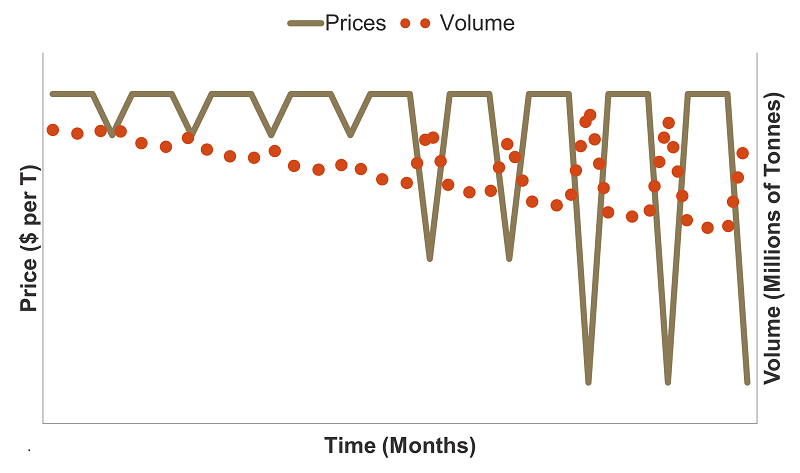
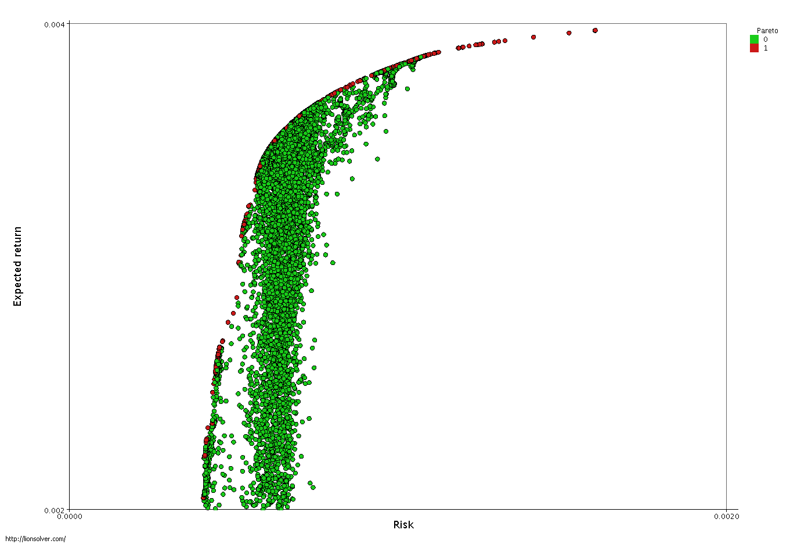
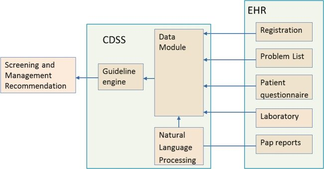

```{r, include = FALSE}
library(fontawesome)
library(xaringanthemer)
library(emojifont)

options(htmltools.dir.version = FALSE)
knitr::opts_chunk$set(
  #fig.width=9, fig.height=3.5, fig.retina=3,
  #out.width = "100%",
  cache = FALSE,
  echo = TRUE,
  message = FALSE, 
  warning = FALSE,
  fig.show = TRUE,
  hiline = TRUE
)

style_mono_light(base_color = "#1F4257",
#  primary_color = "#1F4257", secondary_color = "#F97B64",
  header_font_google = google_font("Josefin Sans"),
  text_font_google   = google_font("Montserrat", "300", "300i"),
  code_font_google   = google_font("Fira Mono"),
  colors = c(
  red = "#F97B64",
  blue = "#1F4257",
  purple = "#3e2f5b",
  orange = "#ff8811",
  green = "#136f63",
  white = "#FFFFFF")
)
```

class: title-slide, left, middle
background-image: url("images/plane.png")
background-position: fill
background-color: #F6F6F5


.pull-right[

# .blue[`r rmarkdown::metadata$title`]

### .blue[`r rmarkdown::metadata$subtitle`]

### .blue[`r rmarkdown::metadata$author`]

### .blue[`r rmarkdown::metadata$institute`]

### .blue[`r rmarkdown::metadata$date`]
]


---
layout: true
class: center, middle
background-image: url("images/plane.png")

---

# `r emoji("wave")` 
# Hello! 


[`r fontawesome::fa("github")` @EnricoManlapig](https://github.com/enricomanlapig)
[`r fontawesome::fa("twitter")` @EnricoManlapig](https://twitter.com/EnricoManlapig)
[`r fontawesome::fa("link")` emanlapig.net](https://emanlapig.net)


---


# `r emoji("point_up")` 
# REMEMBER!
# My situation is unique to me...

--

# ...and your situation is unique to you!

???

What I share with you here probably does not apply to you!
Don't do what I did.  But find *general* principles about what helped you


---


## Where you intend may not be where you end up


### I wanted to be a musician! 


---

## Sometimes you need a little extra motivation


---

## (Crazy) Professors can help you expand your vision 


???
**Ghanshyam Mehta** gave great grades and showed me that mathematics is about much more than notation

- struggle and beauty: "proving this theorem is like climbing a mountain every step is so painful but the view from the top is truly spectacular"

- knowing something is different to doing something: "what does it mean to solve a problem if you already know that a solution exists? what have you done?"

**Rodney Beard**

- i taught the entire statistics class with venn diagrams.  they have no idea what's happening.

- i wrote a paper about optimal lateness

- crossing a 4-way intersection - you should cross all the way round

- learn latex


---

# Look for distinctive projects

.pull-left[
## Combinatorial games...

]
.pull-right[
## ...under auction play

]


---

# Present your work whenever you get the opportunity


---

## `r emoji("point_up")` Know the recruiting calendar

--

## `r emoji("point_up")` Expand and leverage your network 

--

## `r emoji("point_up")` Research firms in your desired field

---

## I didn't do any of these things 


???

These are safer and more reliable paths into a good job


---

# MANAGEMENT CONSULTING


--


### Management consulting is the business of helping organizations improve their performance by identifying problems and recommending solutions

---
layout: true
background-image: url("images/plane.png")
background-position: fill
---
# Types of management consultants


.pull-left[

#### Strategy

#### IT

#### Finance

#### Marketing

#### Compliance

#### HR

#### Economics

]


.pull-right[

#### One-stop shop

#### Boutiques

#### Partnerships and sole propietaries


]

???
Strategy boutiques
The Big 3: McKinsey, BCG, Bain
Second Tier: LEK, ATK

IT specialists
Accenture, Bearing Point, IBM

Industry specialists
Booz, Kurt Salmon, Oliver Wyman

Technical specialists
NERA, Strategic Decisions Group, Mercer

The Big 4
Deloitte
KPMG
Ernst & Young
PwC

Typical functions
Audit
Tax
Financial advisory
Strategy & Operations
Technology

---


# APPLIED DECISION ANALYSIS / CAPITAL EFFICIENCY


.pull-left[

### Decision analysis

### Statistical modeling

### Optimization

### Real Option Valuation

]

.pull-right[


]


???
This is not a normal sort of team


---

# Analytics for strategic pricing

.center[]

???

Also revenue management - hotels, airlines, pharma
Choose prices depending on competitors, weather, time of year, type of traveller


---

# Analytics for operations and supply chain management

<iframe width="800" height="500" src="https://www.youtube.com/embed/9avwLOaMd-k?start=7" title="YouTube video player" frameborder="0" allow="accelerometer; autoplay; clipboard-write; encrypted-media; gyroscope; picture-in-picture" allowfullscreen></iframe>


???

Also systems and processes - government child and family protective services
Also network asset companies like pipeline operators

---

# Analytics in finance

.pull-left[
### Derivatives

### Contracts

### Portfolio management
]

.pull-right[

]

---

# Analytics to understand people

<iframe width="800" height="500" src="https://www.youtube.com/embed/EmbRsPf67h8" title="YouTube video player" frameborder="0" allow="accelerometer; autoplay; clipboard-write; encrypted-media; gyroscope; picture-in-picture" allowfullscreen></iframe>


???

Especially useful in decision analysis when trying to understand values
We use Principle Component Analysis to reduce high dimensional responses into a managable number of dimensions.  Or, you can use cluster analysis to identify similar types of customers: early adopters, business users, holiday-makers, children etc.

---

# Analytics for processing unstructured data

<iframe width="800" height="500" src="https://www.youtube.com/embed/wvsE8jm1GzE?start=86" title="YouTube video player" frameborder="0" allow="accelerometer; autoplay; clipboard-write; encrypted-media; gyroscope; picture-in-picture" allowfullscreen></iframe>

???

Especially useful in legal work

---
background-color: #FFFFFF

# Dashboards and decision support systems

.pull-left[



]

.pull-right[Wagholikar, Kavishwar & Maclaughlin, Kathy & Kastner, Thomas & Casey, Petra & Henry, Michael & Greenes, Robert & Liu, Hongfang & Chaudhry, Rajeev. (2013). Formative evaluation of the accuracy of a clinical decision support system for cervical cancer screening. Journal of the American Medical Informatics Association : JAMIA. 20. 10.1136/amiajnl-2013-001613.]

???

Oil and gas and utilities


---
layout: true
class: center, middle
background-image: url("images/plane.png")
---

# `r emoji("point_up")` 

### Management consulting is the business of helping organizations improve their performance by identifying problems and recommending solutions


???

These are skills you can bring to *any* job!


Remember, too that m situation is unique to me...and your situation is unique to you!

What I share with you here probably does not apply to you!
Don't do what I did.  But find *general* principles about what helped you

---

# Problem solving is fun `r emoji("grin")`

--

# `r emoji("raised_hands")` Work is high impact

--

# Exposure is unparalleled `r emoji("camera")`


---


# Competitive `r emoji("japanese_ogre")`

--

# `r emoji("hotel")` Travel gets old

--

# Firm > Client > You `r emoji("bow")`


---
layout: false
class: center, middle
background-image: url("images/stars.jpg")
background-size: cover
background-color: #F5D443


# Coming soon!

.center[### EB020 Research & Forecasting in San Francisco ]

.center[### EB138 Applied Management Science]

.center[### EB196 Decision Lab]