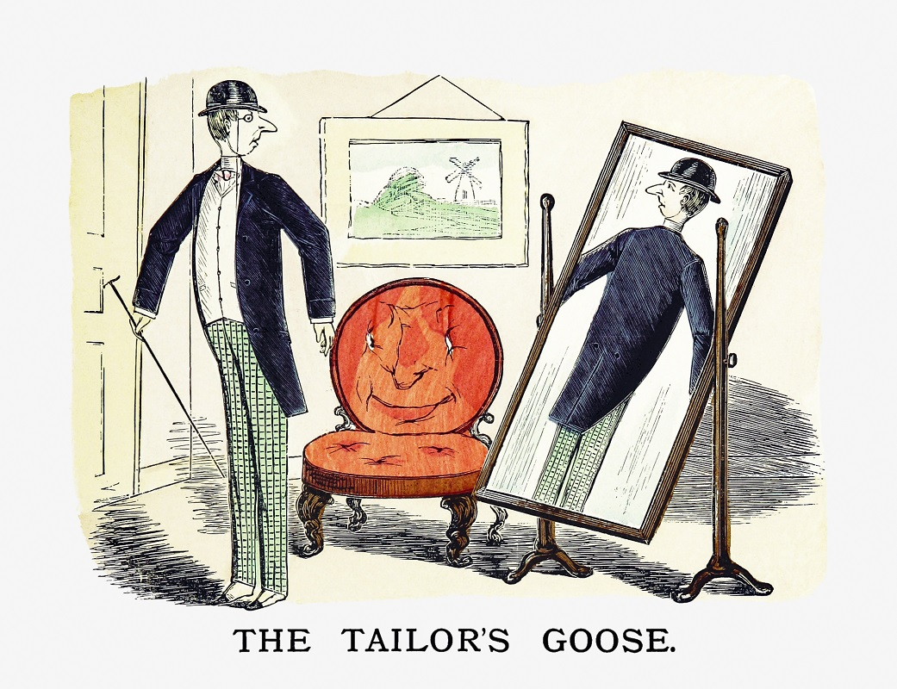

```{r, include = FALSE}
library(fontawesome)
library(xaringanthemer)

options(htmltools.dir.version = FALSE)
knitr::opts_chunk$set(
  #fig.width=9, fig.height=3.5, fig.retina=3,
  #out.width = "100%",
  cache = FALSE,
  echo = TRUE,
  message = FALSE, 
  warning = FALSE,
  fig.show = TRUE,
  hiline = TRUE
)

style_mono_light(base_color = "#1F4257",
#  primary_color = "#1F4257", secondary_color = "#F97B64",
  header_font_google = google_font("Josefin Sans"),
  text_font_google   = google_font("Montserrat", "300", "300i"),
  code_font_google   = google_font("Fira Mono"),
  colors = c(
  red = "#F97B64",
  blue = "#1F4257",
  purple = "#3e2f5b",
  orange = "#ff8811",
  green = "#136f63",
  white = "#FFFFFF")
)
```

class: title-slide, left, middle
background-image: url("images/boot.jpg")
background-position: right
background-size: 60%
background-color: #F6F6F5


.pull-left[

# .blue[`r rmarkdown::metadata$title`]

### .blue[`r rmarkdown::metadata$subtitle`]

### .blue[`r rmarkdown::metadata$author`]

### .blue[`r rmarkdown::metadata$date`]
]

.pull-right[

]

---

name: hello
class: middle, center
background-color: #FFA86D


### `r rmarkdown::metadata$author`


### `r rmarkdown::metadata$role`

### `r rmarkdown::metadata$company`

[`r fontawesome::fa("github")` @enricomanlapig](https://github.com/enricomanlapig)
[`r fontawesome::fa("twitter")` @EnricoManlapig](https://twitter.com/EnricoManlapig)   
[`r fontawesome::fa("link")` emanlapig.net](https://emanlapig.net)


---

class: bottom, center, inverse
background-image: url(images/getting_ready.jpg)
background-position: top
background-size: 70%
background-color: #F7F0EA
# .blue[How do you get ready in the morning?]


---
class: center, middle
background-color: #F4F1EF

# What does it mean to make a good decision?

.pull-left[

]


.pull-right[


]

---
class: center, middle
background-color: #F5F4F0

# Types of analytics


### Descriptive analytics &nbsp;|&nbsp;  Predictive analytics &nbsp;|&nbsp;  Prescriptive analytics


---
class: inverse
background-color: #44272F

# Descriptive analytics

.pull-left[

]

.pull-right[

* Descriptive statistics

* Estimation and inference

* Econometric modeling

* Data visualization

 * Dashboards
]

---
class: 
background-color: #FFEAC1
# Prescriptive analytics


.pull-left[

* Officially: Machine learning methods
  - Supervised
      + Classification
      + Regression
  - Unsupervised
      + Clustering
      + Association
      
* Unofficially `r emo::ji("wink")`: Anything dealing with the future 
  - Subjective beliefs
  - Scenario analysis
  - Simulation
]

.pull-right[
<center></center>
]


---
class: inverse
background-color: #654D4E
# Prescriptive analytics

.pull-left[
* Optimization methods 
    - Operations research
    - Economics
    
* Decision Analytic methods
    - Multi-criteria decision analysis
    - Value focused thinking
]

.pull-right[

]


---
class: center, middle
background-image: url("images/stars.jpg")
background-size: cover
background-color: #F5D443


# Coming soon!

.center[### EB020 Research & Forecasting in San Francisco ]

.center[### EB138 Applied Management Science]

.center[### EB196 Decision Lab]